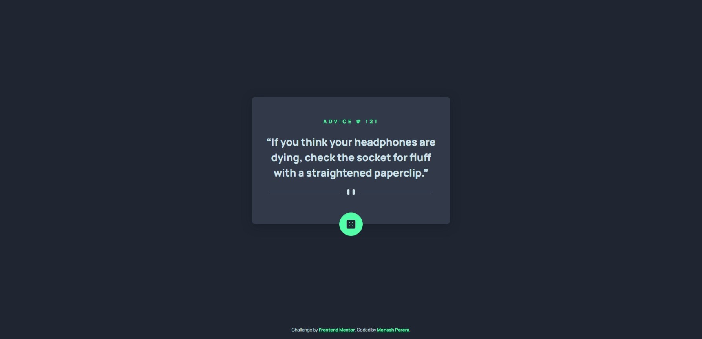
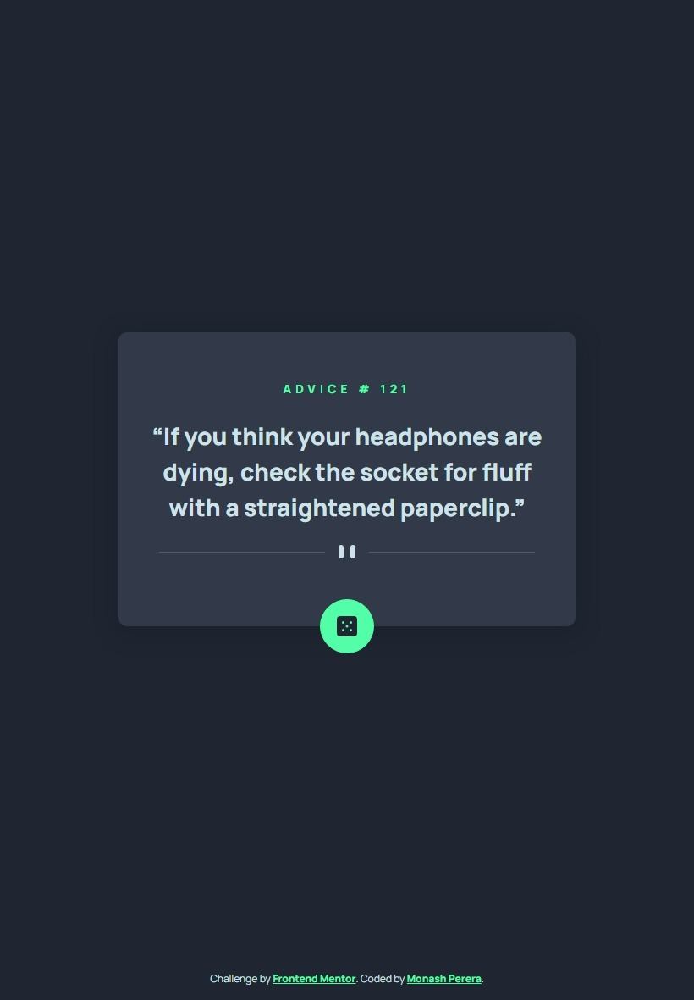
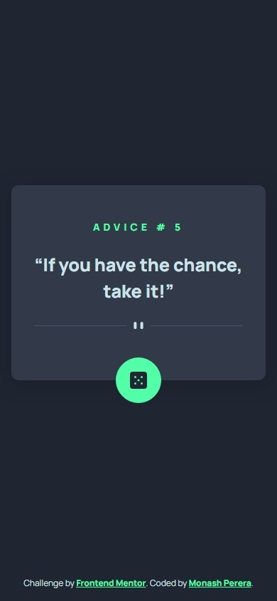

# Frontend Mentor - Advice generator app solution

This is a solution to the [Advice generator app challenge on Frontend Mentor](https://www.frontendmentor.io/challenges/advice-generator-app-QdUG-13db). Frontend Mentor challenges help you improve your coding skills by building realistic projects.

## Table of contents

- [Overview](#overview)
  - [Screenshot](#screenshot)
  - [Links](#links)
- [My process](#my-process)
  - [Built with](#built-with)
- [Author](#author)
- [Acknowledgments](#acknowledgments)

## Overview

### Screenshot

Desktop Preview

Tablet Preview

Mobile Preview

### Links

- Live Site URL: [https://monashperera.github.io/advice-generator-app/](https://monashperera.github.io/advice-generator-app/)

## My process

### Built with

- Semantic HTML5 markup
- CSS custom properties
- Flexbox
- Mobile-first workflow
- [Bootstrap 5](https://getbootstrap.com) - CSS framework
- [Advice Slip API](https://api.adviceslip.com/) - API

## Author

- Frontend Mentor - [@monashperera](https://www.frontendmentor.io/profile/monashperera)

## Acknowledgments

Thank you frontendmentor 👍.
